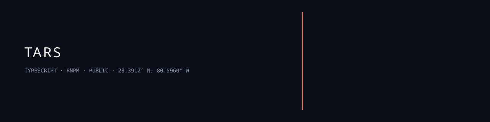

<p align="center">
  
</p>

# Tactical Analysis and Reporting System

`TARS · typescript · pnpm · public · jediswimmer`

> [!NOTE]
> `pnpm demo` needs no API keys. Live runs need keys in `.env`. Do not commit `.env`.

## What it is

A fleet of narrowly scoped, scheduled agents for an MSP. Each agent owns one job and hands a typed artifact to the next.

First workflow: Azure security. Adversarial scan, expert review, technical report, executive views, dashboard notifications, RBAC-scoped chat. One shared fleet, run on Claude, Grok, and Sol (OpenAI) for a bake-off.

Spine is TypeScript, Zod 4, pnpm workspaces. Portal is Next.js 16. Node `>= 20`. Package manager: `pnpm@9.12.0`.

## Install

```bash
pnpm install
```

## Use

```bash
pnpm demo        # six-agent Azure fleet offline against a fixture tenant
pnpm bakeoff     # same pipeline on claude / grok / sol
pnpm test        # contracts, eval ranking, pipeline lineage
pnpm portal      # Next.js dashboard at http://localhost:3000
```

Live:

```bash
cp .env.example .env
TARS_MODE=live pnpm pipeline:azure
TARS_MODE=live pnpm bakeoff
```

Set `ANTHROPIC_API_KEY`, `XAI_API_KEY`, and/or `OPENAI_API_KEY` as needed. Names only.

## Ops

Shared spine: [`platform/`](platform/). Thin adapters: [`providers/claude`](providers/claude), [`providers/grok`](providers/grok), [`providers/sol`](providers/sol). Dashboard: [`portal`](portal).

Docs: [`docs/ARCHITECTURE.md`](docs/ARCHITECTURE.md), [`docs/AGENT-FLEET.md`](docs/AGENT-FLEET.md), [`docs/DATA-CONTRACTS.md`](docs/DATA-CONTRACTS.md), [`docs/PROVIDER-COMPARISON.md`](docs/PROVIDER-COMPARISON.md), [`docs/ROADMAP.md`](docs/ROADMAP.md), [`docs/adr/`](docs/adr/).

Green: `pnpm test` passes. `pnpm demo` writes provenance-stamped artifacts under `runs/artifacts/`.

## Colophon

Titan systems. Human outcomes.

`28.3912° N, 80.5960° W`
