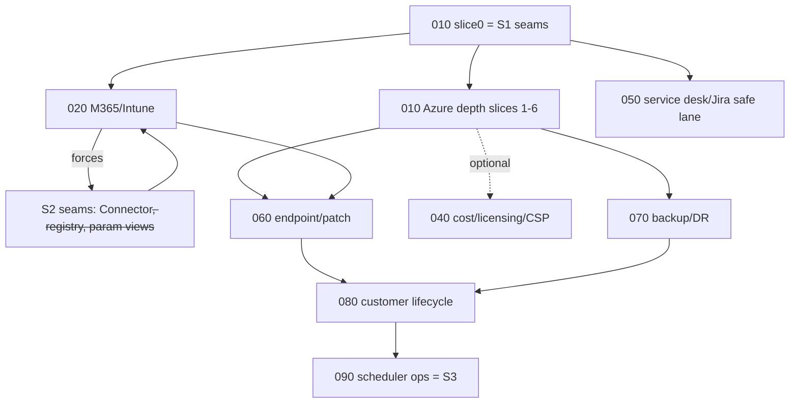

# 000 — MSP Fleet Expansion: Overview, Taxonomy & Template

> **This directory is a handoff.** Each numbered doc is written so a fresh agent
> loop — with **no access to the conversation that produced it** — can execute it
> end-to-end. Every doc restates the orientation, guardrails, and acceptance
> criteria it needs; none depends on another being open. This file (`000`) is the
> index, the MSP facet taxonomy, and the **template** every other doc follows.

---

## Repo orientation (the 10-line version — embedded in every doc)

TARS is a pnpm monorepo (`pnpm-workspace.yaml`). An MSP runs a **fleet of small,
single-purpose, scheduled agents**; **artifacts are the handoff currency**.

- **Packages:** `platform/contracts` (Zod schemas + types, the shared spine),
  `platform/core` (`BaseAgent`, `FileArtifactStore`, registry, ids, logger),
  `platform/agents` (the fleet — one class per role, provider-agnostic),
  `platform/connectors` (data sources; Azure today), `platform/orchestrator`
  (`run.ts`, `pipeline.ts`, fixtures, bake-off, scheduler), `platform/evals`
  (rubric + run comparison), `providers/{claude,grok,sol}` (LLM ports),
  `portal` (Next.js dashboard).
- **An agent** extends `BaseAgent<Body>`, is described by an `AgentDefinition`
  (`platform/contracts/src/agent.ts`: `id/consumes/produces/schedule`), takes
  `{ provider, prompts? }`, and implements `produce(ctx)`. It only ever touches
  `ctx.llm` (the port), its input artifacts, and its output body.
- **The pipeline** (`platform/orchestrator/src/pipeline.ts`) is an implicit DAG:
  each agent declares the artifact `kind`s it `consumes`; the runner resolves them
  from the store with `store.latest(kind, customerId)` (newest wins) and persists
  the one artifact it `produces`.
- **Offline vs live:** `TARS_MODE=offline` (default) replays `CANNED_CLAUDE_RUN`
  (`platform/orchestrator/src/fixtures/canned-claude-run.ts`) — no credentials.
  `TARS_MODE=live` uses the real provider. The Azure snapshot comes from
  `FixtureAzureConnector` (offline) or `LiveAzureConnector` (live), selected by
  `makeAzureConnector(mode, creds)` (`platform/connectors/src/azure/client.ts`).

## Commands (embedded in every doc)

```bash
pnpm install              # once per clone
pnpm -r typecheck         # all packages
pnpm test                 # node --test over tests/*.test.ts
pnpm demo                 # offline pipeline → prints artifacts (no credentials)
pnpm pipeline:azure       # the Azure security pipeline (offline by default)
pnpm bakeoff              # 3-provider comparison
pnpm portal               # Next.js dashboard dev server
```

## Guardrails (embedded in every doc)

1. **Connectors are read-only.** Every live query uses a read-only service
   principal / least-privilege Graph scope. Never write to a tenant.
2. **Secrets never land in artifacts or fixtures.** Snapshots carry config
   posture, not credentials. Scrub tokens/keys/connection strings before recording
   a fixture.
3. **Reviewer gate before customer-facing output.** No scanner finding reaches a
   report/notification without passing through the reviewer stage (validates,
   kills false positives, risk-scores). Customer-facing prose is always
   reviewer-approved.
4. **The demo-coherence rule.** Every fixture change must:
   (a) keep `platform/connectors/src/azure/fixtures/contoso-financial.json` valid
   against the snapshot schema; (b) **regenerate**
   `platform/orchestrator/src/fixtures/canned-claude-run.ts` so `pnpm demo` still
   tells a coherent story; (c) keep `portal/lib/sample.ts` counts coherent with
   the demo; and (d) for **every new check**, add both a **failing** and a
   **passing** exemplar in Contoso so the reviewer visibly earns its keep.

## The growth recipe (verbatim from `docs/AGENT-FLEET.md` — embedded in every doc)

1. If it introduces a new artifact type, add its schema to
   `platform/contracts/src/artifacts/` and to the `ArtifactKind` enum.
2. Add the agent class + default prompt to `platform/agents/src/` (it works for
   all three providers at once).
3. Add it to `createAzureFleet()` (or a new fleet) in
   `platform/agents/src/fleet.ts`.
4. Add its id to the relevant pipeline stage list (e.g. `AZURE_SECURITY_PIPELINE`).

> `ArtifactKind` is a **closed `z.enum`** (`platform/contracts/src/artifact.ts`).
> Grow it by convention `<domain>_<stage>` (e.g. `m365_scan_findings`). The closed
> enum keeps `store.latest(kind)` and portal routing fully typed; revisit only if a
> fleet must ship outside this repo.

---

## The MSP facet taxonomy

TARS today covers exactly one facet (Azure posture) with one pipeline. An MSP has
many. The facets below are the map; each maps to one or more docs in this
directory.

| Facet | What it is | Shape | Status | Doc |
|---|---|---|---|---|
| **F1** | Azure posture | 6-agent adversarial pipeline (exists) | deepen | `010` |
| **F2** | M365 / Intune posture | parallel pipeline, same 6 roles | new | `020` |
| **F3** | Identity / CA / PIM | tenant data feeding F1+F2 — **not** its own workflow | folded into `010`/`020` | `010` sl.1,3 |
| **F4** | Endpoint / RMM + patch | Intune-first health + patch compliance | new | `060` |
| **F5** | Backup / DR | collect→assess→notify, **no adversarial review** | new | `070` |
| **F6** | Cost / licensing / CSP | deterministic math in code, LLM narrates | new | `040` |
| **F6b** | GDAP health | delegated-admin relationship posture | new | `040` |
| **F7** | Service desk / Jira | collapsed analyst stage, ticket summaries | new | `050` |
| **F8** | Customer lifecycle | aggregators: onboarding, QBR, health score | new | `080` |
| **F9** | Compliance | cross-cutting schema **convention**, not a fleet | convention | all |

**Design invariants across facets:**
- Same 6 roles (scanner → reviewer → report-author → exec-view → tech-view →
  notification) wherever there's an adversarial-review shape (F1, F2). F5/F6 skip
  the adversarial reviewer (posture is deterministic, not contested).
- A new facet is a **new fleet + new pipeline registry entry**, never a fork of the
  orchestrator. The seam work in `030` makes this true.
- Deterministic facets (F6 cost) compute the numbers in code and use the LLM only
  to narrate — never to do arithmetic.

---

## Doc index & dependency graph

```
000-overview.md            this file — template, taxonomy, conventions
010-azure-depth.md         FIRST. 7 slices. Embeds seam batch S1 (slice 0).
020-m365-intune-posture.md second facet. Per-domain report. Embeds seam batch S2.
030-platform-seams.md      registry, generic Connector<S>, view-agent parameterization
040-cost-licensing-csp.md  Partner Center + Azure cost + GDAP health (Phase 3)
050-service-desk-jira.md   safe parallel lane (no Azure/Graph surface)
060-endpoint-patch.md      depends 020 + 010
070-backup-dr.md           collect→assess→notify
080-customer-lifecycle.md  onboarding, QBR generator, health score
090-scheduler-operations.md seam batch S3; scheduler goes real (LAST)
```



### Sequencing (max two loops in flight; never two touching `contracts/` or the orchestrator in the same phase)
- **Phase 1:** `010` solo (slices 0–2).
- **Phase 2:** `010` finishes ∥ `030` ∥ `050` (safe lane, no Azure/Graph surface).
- **Phase 3:** `020` M365 ∥ `040` cost.
- **Phase 4:** `060` ∥ `070`.
- **Phase 5:** `080` → `090`.

### Platform seams — introduced just-in-time, never big-bang
- **S1** (in `010` slice 0): CLI flags on `run.ts` + Zod snapshot + `snapshotVersion`.
- **S2** (in `020`): generic `Connector<S>`, config namespacing
  `snapshots.{azure,m365}`, parameterized view/notification agents, pipeline
  registry. Detailed in `030`.
- **S3** (in `090`): real `node-cron` scheduler daemon, then ACA Jobs; persistent
  store replacing `FileArtifactStore`.

---

## The per-doc template

Every doc `010`–`090` MUST contain these sections, in this order:

1. **Facet & goal** — one paragraph: what facet, what the loop ships, why now.
2. **Repo orientation** — the 10-line block above (copy verbatim).
3. **Commands** — the command block above (copy verbatim).
4. **Guardrails** — the guardrails block above (copy verbatim).
5. **Growth recipe** — the recipe block above (copy verbatim).
6. **Current state** — exact file paths this doc touches, with what's there today
   (cite line numbers where useful). This is what makes it executable cold.
7. **Slices** — each slice = one PR. Same inner recipe: *Zod snapshot section →
   live query → grow fixture (fail+pass exemplars) → scanner/agent prompt →
   regenerate canned run → tests.* Number them; note dependencies.
8. **Live-validation gate** — tenant-zero = **Dynapt's own tenant**. Each slice
   adds: "live capture succeeds against Dynapt with documented least-privilege
   grants." List the exact grants required.
9. **Acceptance criteria** — runnable. Minimum: `pnpm -r typecheck` + `pnpm test`
   green; `pnpm demo` coherent; fixture validates; the new check has fail+pass
   exemplars.

## Conventions
- **Sub-snapshot naming:** name identity/tenant sub-snapshots for cross-facet reuse
  (e.g. `entra`, not `azureIdentity`) so `020` M365 can consume the same shape.
- **ArtifactKind naming:** `<domain>_<stage>` — `azure_scan_findings`,
  `m365_scan_findings`, `cost_report`.
- **One artifact per agent.** If you need two outputs, you need two agents.
- **Prompts are per-provider tunable** but the decomposition is identical across
  providers (that's what keeps the bake-off fair).
